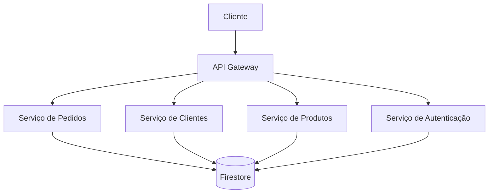

# Arquitetura - Sistema de Gestão para Gráficas

## Índice
1. [Visão Geral](#visão-geral)
2. [Frontend](#frontend)
3. [Backend](#backend)
4. [Database](#database)
5. [Integrações](#integrações)
6. [Segurança](#segurança)
7. [Recomendações](#recomendações)

## Visão Geral

O Sistema de Gestão para Gráficas utiliza uma arquitetura moderna baseada em microserviços.

### Diagrama



### Componentes Principais

1. **Frontend**
   - React
   - Next.js
   - Material-UI

2. **Backend**
   - Node.js
   - Express
   - Firebase Functions

3. **Database**
   - Firestore
   - Firebase Storage

4. **Infraestrutura**
   - Firebase Hosting
   - Cloud Functions
   - Cloud Storage

## Frontend

### 1. Estrutura de Diretórios

```
src/
  ├── components/
  │   ├── common/
  │   ├── layout/
  │   └── pages/
  ├── pages/
  │   ├── api/
  │   └── app/
  ├── services/
  │   ├── api/
  │   └── firebase/
  ├── hooks/
  │   ├── auth/
  │   └── data/
  ├── contexts/
  │   ├── auth/
  │   └── theme/
  ├── utils/
  │   ├── validation/
  │   └── formatting/
  ├── styles/
  │   ├── theme/
  │   └── global/
  └── assets/
      ├── images/
      └── icons/
```

### 2. Padrões de Componentes

```typescript
// components/common/Button.tsx
import React from 'react';
import { Button as MuiButton } from '@mui/material';

interface ButtonProps {
  variant?: 'text' | 'contained' | 'outlined';
  color?: 'primary' | 'secondary' | 'error' | 'info' | 'success' | 'warning';
  size?: 'small' | 'medium' | 'large';
  disabled?: boolean;
  onClick?: () => void;
  children: React.ReactNode;
}

export const Button: React.FC<ButtonProps> = ({
  variant = 'contained',
  color = 'primary',
  size = 'medium',
  disabled = false,
  onClick,
  children
}) => {
  return (
    <MuiButton
      variant={variant}
      color={color}
      size={size}
      disabled={disabled}
      onClick={onClick}
    >
      {children}
    </MuiButton>
  );
};
```

### 3. Gerenciamento de Estado

```typescript
// contexts/auth/AuthContext.tsx
import React, { createContext, useContext, useState, useEffect } from 'react';
import { getAuth, onAuthStateChanged, User } from 'firebase/auth';

interface AuthContextData {
  user: User | null;
  loading: boolean;
  signIn: (email: string, password: string) => Promise<void>;
  signOut: () => Promise<void>;
}

const AuthContext = createContext<AuthContextData>({} as AuthContextData);

export const AuthProvider: React.FC = ({ children }) => {
  const [user, setUser] = useState<User | null>(null);
  const [loading, setLoading] = useState(true);
  const auth = getAuth();

  useEffect(() => {
    const unsubscribe = onAuthStateChanged(auth, (user) => {
      setUser(user);
      setLoading(false);
    });

    return unsubscribe;
  }, [auth]);

  const signIn = async (email: string, password: string) => {
    try {
      await auth.signInWithEmailAndPassword(email, password);
    } catch (error) {
      throw new Error('Erro ao fazer login');
    }
  };

  const signOut = async () => {
    try {
      await auth.signOut();
    } catch (error) {
      throw new Error('Erro ao fazer logout');
    }
  };

  return (
    <AuthContext.Provider value={{ user, loading, signIn, signOut }}>
      {children}
    </AuthContext.Provider>
  );
};

export const useAuth = () => {
  const context = useContext(AuthContext);
  if (!context) {
    throw new Error('useAuth deve ser usado dentro de um AuthProvider');
  }
  return context;
};
```

## Backend

### 1. Estrutura de Serviços

```typescript
// services/OrderService.ts
import { getFirestore } from 'firebase-admin/firestore';

const db = getFirestore();

export class OrderService {
  async create(data: any) {
    try {
      const order = {
        ...data,
        createdAt: new Date(),
        updatedAt: new Date()
      };
      
      const docRef = await db.collection('orders').add(order);
      return { id: docRef.id, ...order };
    } catch (error) {
      throw new Error('Erro ao criar pedido');
    }
  }

  async update(id: string, data: any) {
    try {
      await db.collection('orders').doc(id).update({
        ...data,
        updatedAt: new Date()
      });
      
      return true;
    } catch (error) {
      throw new Error('Erro ao atualizar pedido');
    }
  }

  async delete(id: string) {
    try {
      await db.collection('orders').doc(id).delete();
      return true;
    } catch (error) {
      throw new Error('Erro ao deletar pedido');
    }
  }

  async list(filters: any = {}) {
    try {
      let query = db.collection('orders');
      
      if (filters.status) {
        query = query.where('status', '==', filters.status);
      }
      
      if (filters.client) {
        query = query.where('client', '==', filters.client);
      }
      
      const snapshot = await query.get();
      return snapshot.docs.map(doc => ({
        id: doc.id,
        ...doc.data()
      }));
    } catch (error) {
      throw new Error('Erro ao listar pedidos');
    }
  }
}
```

### 2. Middleware

```typescript
// middleware/auth.ts
import { Request, Response, NextFunction } from 'express';
import { getAuth } from 'firebase-admin/auth';

export async function authMiddleware(
  req: Request,
  res: Response,
  next: NextFunction
) {
  try {
    const authHeader = req.headers.authorization;
    
    if (!authHeader) {
      return res.status(401).json({ error: 'Token não fornecido' });
    }
    
    const token = authHeader.split(' ')[1];
    const decodedToken = await getAuth().verifyIdToken(token);
    
    req.user = decodedToken;
    next();
  } catch (error) {
    res.status(401).json({ error: 'Token inválido' });
  }
}

export function roleMiddleware(roles: string[]) {
  return async (req: Request, res: Response, next: NextFunction) => {
    try {
      if (!req.user) {
        return res.status(401).json({ error: 'Não autenticado' });
      }
      
      if (!roles.includes(req.user.role)) {
        return res.status(403).json({ error: 'Não autorizado' });
      }
      
      next();
    } catch (error) {
      res.status(500).json({ error: 'Erro interno' });
    }
  };
}
```

### 3. Validação

```typescript
// utils/validation.ts
import Joi from 'joi';

export function validate(data: any, schema: Joi.Schema) {
  try {
    const { error, value } = schema.validate(data, {
      abortEarly: false,
      stripUnknown: true
    });
    
    if (error) {
      throw new Error(error.details.map(detail => detail.message).join(', '));
    }
    
    return value;
  } catch (error) {
    throw new Error('Erro ao validar dados');
  }
}

export const schemas = {
  order: Joi.object({
    client: Joi.string().required(),
    products: Joi.array().items(
      Joi.object({
        id: Joi.string().required(),
        quantity: Joi.number().required().min(1)
      })
    ).required(),
    total: Joi.number().required().min(0)
  }),
  
  client: Joi.object({
    name: Joi.string().required().min(3),
    email: Joi.string().required().email(),
    phone: Joi.string().required(),
    address: Joi.object({
      street: Joi.string().required(),
      number: Joi.string().required(),
      city: Joi.string().required(),
      state: Joi.string().required(),
      zipCode: Joi.string().required()
    }).required()
  }),
  
  product: Joi.object({
    name: Joi.string().required().min(3),
    description: Joi.string().required(),
    price: Joi.number().required().min(0),
    stock: Joi.number().required().min(0)
  })
};
```

## Database

### 1. Estrutura

```typescript
// database/schema.ts
interface User {
  id: string;
  name: string;
  email: string;
  role: string;
  permissions: string[];
  createdAt: Date;
  updatedAt: Date;
}

interface Client {
  id: string;
  name: string;
  email: string;
  phone: string;
  address: {
    street: string;
    number: string;
    city: string;
    state: string;
    zipCode: string;
  };
  createdAt: Date;
  updatedAt: Date;
}

interface Product {
  id: string;
  name: string;
  description: string;
  price: number;
  stock: number;
  createdAt: Date;
  updatedAt: Date;
}

interface Order {
  id: string;
  client: string;
  products: {
    id: string;
    quantity: number;
  }[];
  total: number;
  status: string;
  createdAt: Date;
  updatedAt: Date;
}
```

### 2. Regras de Segurança

```javascript
// firestore.rules
rules_version = '2';
service cloud.firestore {
  match /databases/{database}/documents {
    // Funções auxiliares
    function isAuthenticated() {
      return request.auth != null;
    }
    
    function isAdmin() {
      return isAuthenticated() && request.auth.token.role == 'admin';
    }
    
    function isOwner(userId) {
      return isAuthenticated() && request.auth.uid == userId;
    }
    
    // Regras para usuários
    match /users/{userId} {
      allow read: if isAuthenticated();
      allow write: if isAdmin();
    }
    
    // Regras para clientes
    match /clients/{clientId} {
      allow read: if isAuthenticated();
      allow write: if isAdmin();
    }
    
    // Regras para produtos
    match /products/{productId} {
      allow read: if isAuthenticated();
      allow write: if isAdmin();
    }
    
    // Regras para pedidos
    match /orders/{orderId} {
      allow read: if isAuthenticated();
      allow create: if isAuthenticated();
      allow update: if isAdmin() || isOwner(resource.data.userId);
      allow delete: if isAdmin();
    }
  }
}
```

### 3. Índices

```javascript
// firestore.indexes.json
{
  "indexes": [
    {
      "collectionGroup": "orders",
      "queryScope": "COLLECTION",
      "fields": [
        { "fieldPath": "status", "order": "ASCENDING" },
        { "fieldPath": "createdAt", "order": "DESCENDING" }
      ]
    },
    {
      "collectionGroup": "products",
      "queryScope": "COLLECTION",
      "fields": [
        { "fieldPath": "category", "order": "ASCENDING" },
        { "fieldPath": "price", "order": "ASCENDING" }
      ]
    },
    {
      "collectionGroup": "clients",
      "queryScope": "COLLECTION",
      "fields": [
        { "fieldPath": "city", "order": "ASCENDING" },
        { "fieldPath": "name", "order": "ASCENDING" }
      ]
    }
  ],
  "fieldOverrides": []
}
```

## Integrações

### 1. APIs Externas

```typescript
// services/ExternalApiService.ts
import axios from 'axios';

export class ExternalApiService {
  private api: any;
  
  constructor(baseURL: string, token: string) {
    this.api = axios.create({
      baseURL,
      headers: {
        Authorization: `Bearer ${token}`
      }
    });
  }
  
  async get(endpoint: string, params?: any) {
    try {
      const response = await this.api.get(endpoint, { params });
      return response.data;
    } catch (error) {
      throw new Error('Erro ao fazer requisição GET');
    }
  }
  
  async post(endpoint: string, data: any) {
    try {
      const response = await this.api.post(endpoint, data);
      return response.data;
    } catch (error) {
      throw new Error('Erro ao fazer requisição POST');
    }
  }
  
  async put(endpoint: string, data: any) {
    try {
      const response = await this.api.put(endpoint, data);
      return response.data;
    } catch (error) {
      throw new Error('Erro ao fazer requisição PUT');
    }
  }
  
  async delete(endpoint: string) {
    try {
      const response = await this.api.delete(endpoint);
      return response.data;
    } catch (error) {
      throw new Error('Erro ao fazer requisição DELETE');
    }
  }
}
```

### 2. Webhooks

```typescript
// services/WebhookService.ts
import { getFirestore } from 'firebase-admin/firestore';
import axios from 'axios';

const db = getFirestore();

export class WebhookService {
  async register(url: string, events: string[]) {
    try {
      const webhook = {
        url,
        events,
        createdAt: new Date(),
        updatedAt: new Date()
      };
      
      const docRef = await db.collection('webhooks').add(webhook);
      return { id: docRef.id, ...webhook };
    } catch (error) {
      throw new Error('Erro ao registrar webhook');
    }
  }
  
  async trigger(event: string, data: any) {
    try {
      const webhooks = await db.collection('webhooks')
        .where('events', 'array-contains', event)
        .get();
        
      const promises = webhooks.docs.map(async (doc) => {
        const webhook = doc.data();
        
        try {
          await axios.post(webhook.url, {
            event,
            data,
            timestamp: new Date()
          });
          
          return {
            webhookId: doc.id,
            status: 'success'
          };
        } catch (error) {
          return {
            webhookId: doc.id,
            status: 'error',
            error: error.message
          };
        }
      });
      
      return await Promise.all(promises);
    } catch (error) {
      throw new Error('Erro ao disparar webhooks');
    }
  }
}
```

### 3. Filas

```typescript
// services/QueueService.ts
import { getFirestore } from 'firebase-admin/firestore';

const db = getFirestore();

export class QueueService {
  async enqueue(queue: string, data: any) {
    try {
      const item = {
        queue,
        data,
        status: 'pending',
        attempts: 0,
        createdAt: new Date(),
        updatedAt: new Date()
      };
      
      const docRef = await db.collection('queues').add(item);
      return { id: docRef.id, ...item };
    } catch (error) {
      throw new Error('Erro ao enfileirar item');
    }
  }
  
  async process(queue: string) {
    try {
      const items = await db.collection('queues')
        .where('queue', '==', queue)
        .where('status', '==', 'pending')
        .limit(10)
        .get();
        
      const promises = items.docs.map(async (doc) => {
        const item = doc.data();
        
        try {
          // Processa item
          await this.processItem(item);
          
          // Atualiza status
          await doc.ref.update({
            status: 'completed',
            updatedAt: new Date()
          });
          
          return {
            itemId: doc.id,
            status: 'success'
          };
        } catch (error) {
          // Incrementa tentativas
          await doc.ref.update({
            attempts: item.attempts + 1,
            status: item.attempts >= 3 ? 'failed' : 'pending',
            updatedAt: new Date()
          });
          
          return {
            itemId: doc.id,
            status: 'error',
            error: error.message
          };
        }
      });
      
      return await Promise.all(promises);
    } catch (error) {
      throw new Error('Erro ao processar fila');
    }
  }
  
  private async processItem(item: any) {
    // Implementa lógica de processamento
    switch (item.queue) {
      case 'orders':
        await this.processOrder(item.data);
        break;
        
      case 'notifications':
        await this.processNotification(item.data);
        break;
        
      default:
        throw new Error('Fila não suportada');
    }
  }
  
  private async processOrder(data: any) {
    // Implementa processamento de pedido
  }
  
  private async processNotification(data: any) {
    // Implementa processamento de notificação
  }
}
```

## Segurança

### 1. Autenticação

```typescript
// services/AuthService.ts
import { getAuth } from 'firebase-admin/auth';

export class AuthService {
  async createUser(data: any) {
    try {
      const user = await getAuth().createUser({
        email: data.email,
        password: data.password,
        displayName: data.name,
        emailVerified: false,
        disabled: false
      });
      
      await getAuth().setCustomUserClaims(user.uid, {
        role: data.role,
        permissions: data.permissions
      });
      
      return user;
    } catch (error) {
      throw new Error('Erro ao criar usuário');
    }
  }
  
  async updateUser(uid: string, data: any) {
    try {
      await getAuth().updateUser(uid, {
        email: data.email,
        displayName: data.name,
        disabled: data.disabled
      });
      
      if (data.role || data.permissions) {
        await getAuth().setCustomUserClaims(uid, {
          role: data.role,
          permissions: data.permissions
        });
      }
      
      return true;
    } catch (error) {
      throw new Error('Erro ao atualizar usuário');
    }
  }
  
  async deleteUser(uid: string) {
    try {
      await getAuth().deleteUser(uid);
      return true;
    } catch (error) {
      throw new Error('Erro ao deletar usuário');
    }
  }
}
```

### 2. Autorização

```typescript
// services/PermissionService.ts
import { getFirestore } from 'firebase-admin/firestore';

const db = getFirestore();

export class PermissionService {
  async checkPermission(userId: string, permission: string) {
    try {
      const user = await db.collection('users').doc(userId).get();
      
      if (!user.exists) {
        return false;
      }
      
      const userData = user.data();
      return userData?.permissions?.includes(permission) || false;
    } catch (error) {
      throw new Error('Erro ao verificar permissão');
    }
  }
  
  async grantPermission(userId: string, permission: string) {
    try {
      const user = await db.collection('users').doc(userId).get();
      
      if (!user.exists) {
        throw new Error('Usuário não encontrado');
      }
      
      const userData = user.data();
      const permissions = userData?.permissions || [];
      
      if (!permissions.includes(permission)) {
        permissions.push(permission);
        
        await user.ref.update({
          permissions,
          updatedAt: new Date()
        });
      }
      
      return true;
    } catch (error) {
      throw new Error('Erro ao conceder permissão');
    }
  }
  
  async revokePermission(userId: string, permission: string) {
    try {
      const user = await db.collection('users').doc(userId).get();
      
      if (!user.exists) {
        throw new Error('Usuário não encontrado');
      }
      
      const userData = user.data();
      const permissions = userData?.permissions || [];
      
      const index = permissions.indexOf(permission);
      if (index > -1) {
        permissions.splice(index, 1);
        
        await user.ref.update({
          permissions,
          updatedAt: new Date()
        });
      }
      
      return true;
    } catch (error) {
      throw new Error('Erro ao revogar permissão');
    }
  }
}
```

### 3. Criptografia

```typescript
// services/EncryptionService.ts
import crypto from 'crypto';

export class EncryptionService {
  private algorithm = 'aes-256-gcm';
  private key: Buffer;
  
  constructor(encryptionKey: string) {
    this.key = crypto.scryptSync(encryptionKey, 'salt', 32);
  }
  
  encrypt(text: string) {
    try {
      const iv = crypto.randomBytes(16);
      const cipher = crypto.createCipheriv(this.algorithm, this.key, iv);
      
      let encrypted = cipher.update(text, 'utf8', 'hex');
      encrypted += cipher.final('hex');
      
      const authTag = cipher.getAuthTag();
      
      return {
        encrypted,
        iv: iv.toString('hex'),
        authTag: authTag.toString('hex')
      };
    } catch (error) {
      throw new Error('Erro ao criptografar dados');
    }
  }
  
  decrypt(encrypted: string, iv: string, authTag: string) {
    try {
      const decipher = crypto.createDecipheriv(
        this.algorithm,
        this.key,
        Buffer.from(iv, 'hex')
      );
      
      decipher.setAuthTag(Buffer.from(authTag, 'hex'));
      
      let decrypted = decipher.update(encrypted, 'hex', 'utf8');
      decrypted += decipher.final('utf8');
      
      return decrypted;
    } catch (error) {
      throw new Error('Erro ao descriptografar dados');
    }
  }
}
```

## Recomendações

### 1. Performance
- Use lazy loading
- Implemente cache
- Otimize queries
- Monitore métricas

### 2. Escalabilidade
- Use microserviços
- Implemente filas
- Distribua carga
- Monitore recursos

### 3. Manutenção
- Documente código
- Mantenha logs
- Faça testes
- Atualize dependências 